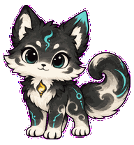

# Modian 墨点

> A thoughtful ink-cloud fox-cat that quietly follows your work in Codex.<br>
> 一只安静陪你工作的水墨狐猫，会呼吸、回应，也会循着你的目光转身。



[Download Modian v1.0.0 / 下载墨点](dist/Modian-v1.0.0.zip)

## Why Modian? / 为什么是墨点

- **Expressive, not distracting.** Nine purpose-built animation states give feedback while keeping the character calm and compact.<br>
  **有回应，不打扰。** 九种动画状态对应工作、等待、检查、失败与互动。
- **Looks where you look.** Sixteen continuous gaze directions make Modian feel present instead of behaving like a static sticker.<br>
  **会自然看向你。** 十六个连续视线方向，让桌宠真正具有陪伴感。
- **Ready in 30 seconds.** It is a complete Codex v2 package with no build step or extra dependency.<br>
  **30 秒即可安装。** 完整 Codex v2 包，无需构建，也不需要额外依赖。

## Install / 安装

1. Download [Modian-v1.0.0.zip](dist/Modian-v1.0.0.zip) and extract it.
2. Copy the extracted `modian` folder to:

   - Windows: `%USERPROFILE%\.codex\pets\modian`
   - macOS/Linux: `~/.codex/pets/modian`

3. Restart Codex and select **Modian / 墨点** in the pet selector.

下载 ZIP 并解压，把其中的 `modian` 文件夹完整复制到对应目录，然后重启 Codex。不要单独重命名或移动 `pet.json` 与 `spritesheet.webp`。

## Design story / 设计故事

Modian combines the softness of an ink cloud with the alert silhouette of a fox-cat. Charcoal and ivory keep it quiet beside code; teal details suggest curiosity, while the amber chest spark represents the useful idea that appears after careful thought.

墨点把墨云的柔软与狐猫的机敏揉在一起。炭黑与米白让它安静地待在代码旁，青绿色代表好奇，胸口的琥珀微光则是认真思考后亮起的那个实用想法。

<details>
<summary><strong>Compatibility and technical details / 兼容性与技术细节</strong></summary>

- Codex `spriteVersionNumber: 2`
- 9 standard animation rows
- 16 clockwise look directions
- Transparent RGBA WebP spritesheet
- 8 × 11 grid at 1536 × 2288 px
- Deterministic atlas validation and independent visual QA passed

Package layout:

```text
modian/
├── pet.json
└── spritesheet.webp
```

</details>

## License

Code, metadata, and original artwork are available under the [MIT License](LICENSE). You may use, modify, and redistribute Modian with attribution.

本仓库中的代码、配置与原创美术资源采用 [MIT License](LICENSE)，可在保留版权与许可声明的前提下使用、修改和再分发。
