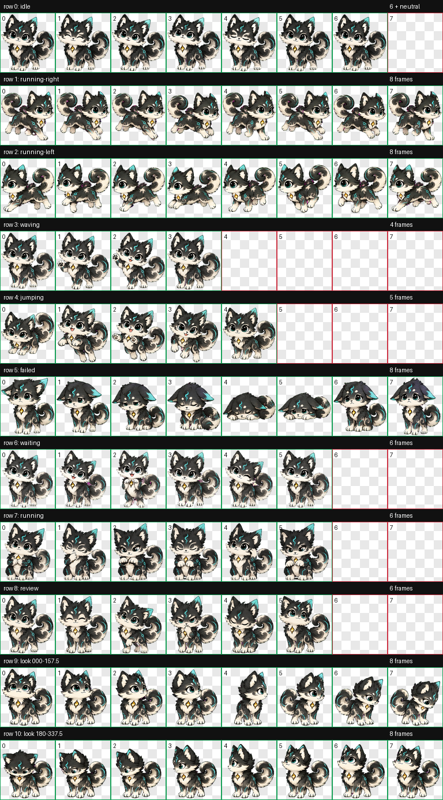

# Modian (墨点) — Codex Animated Pet



Modian is a hand-crafted, Codex-compatible v2 animated desktop pet: a charcoal-and-ivory ink-cloud fox-cat with teal accents and an amber spark.

墨点是一只为 Codex 制作的 v2 动态桌宠：像一团会呼吸的墨云，兼具狐与猫的轮廓，带青绿色点缀和琥珀色胸口微光。

## Features / 特性

- Codex `spriteVersionNumber: 2` package
- 9 standard animation rows
- 16 look directions
- Transparent RGBA WebP spritesheet
- 8 × 11 grid, 1536 × 2288 px

## Install / 安装

1. Download or clone this repository.
2. Copy the entire `modian` folder into your Codex pets directory:

   - Windows: `%USERPROFILE%\.codex\pets\modian`
   - macOS/Linux: `~/.codex/pets/modian`

3. Restart Codex, then choose **Modian / 墨点** in the pet selector.

下载仓库后，把 `modian` 文件夹完整复制到上述 Codex 宠物目录，重启 Codex，并在桌宠选择器中选择“墨点”。请不要单独重命名或移动 `pet.json` 与 `spritesheet.webp`。

## Package layout / 文件结构

```text
modian/
├── pet.json
└── spritesheet.webp
```

## License

Code, metadata, and artwork in this repository are available under the [MIT License](LICENSE). You may use, modify, and redistribute Modian with attribution.

本仓库中的代码、配置与美术资源采用 [MIT License](LICENSE)，可在保留版权与许可声明的前提下使用、修改和再分发。

